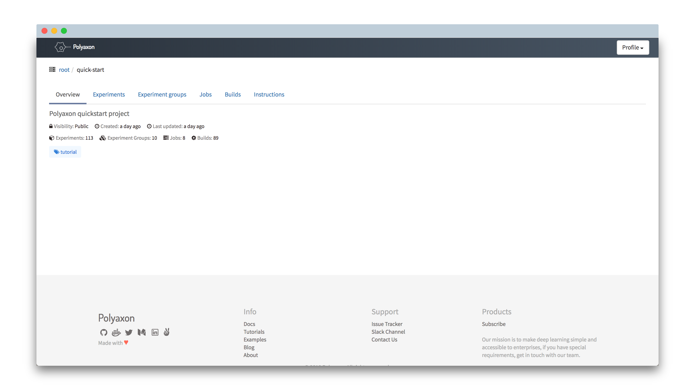
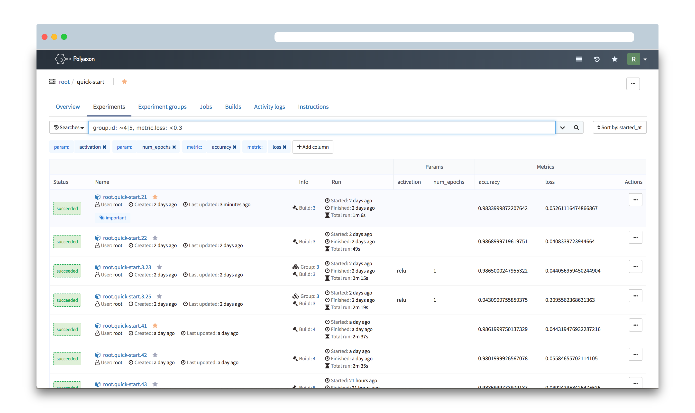
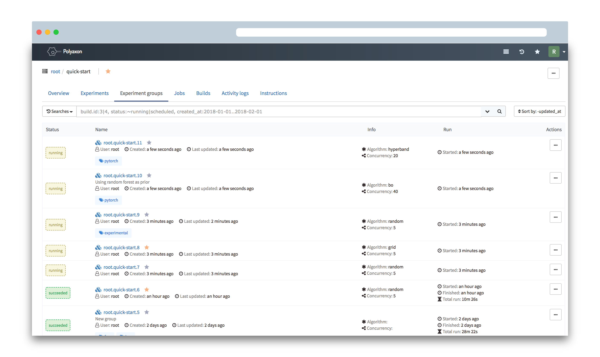
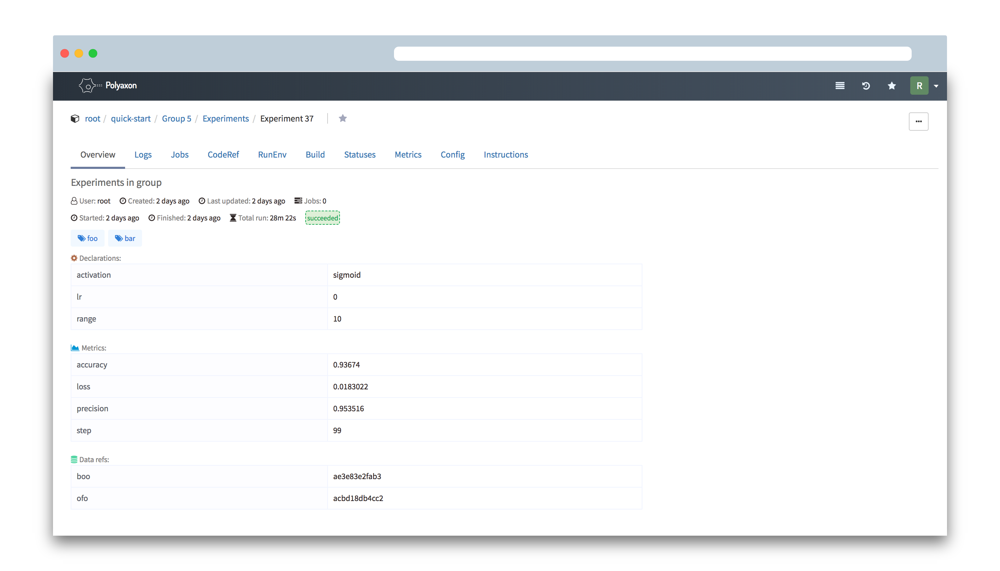
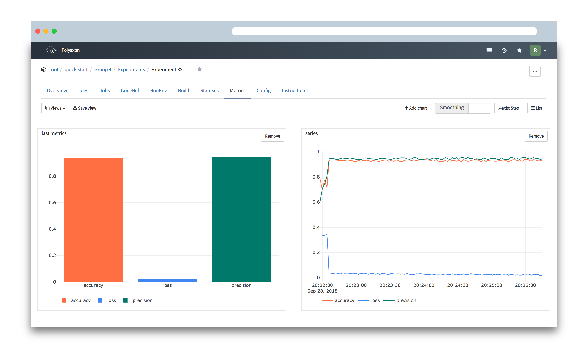
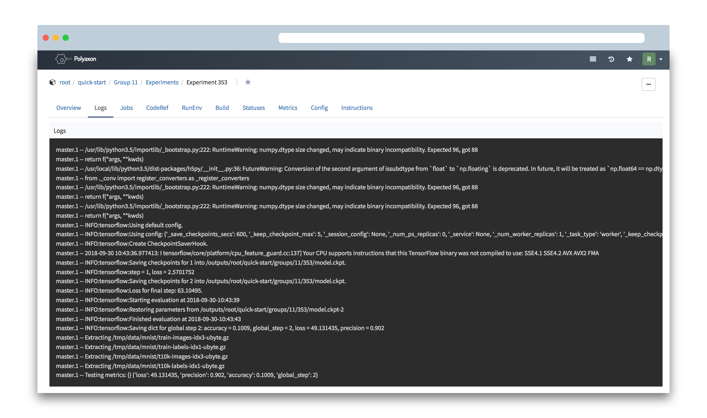

[](https://travis-ci.org/polyaxon/polyaxon)
[](https://docs.polyaxon.com)

[](https://www.codacy.com/app/polyaxon/polyaxon?utm_source=github.com&amp;utm_medium=referral&amp;utm_content=polyaxon/polyaxon&amp;utm_campaign=Badge_Grade)
[](https://join.slack.com/t/polyaxon/shared_invite/enQtMzQ0ODc2MDg1ODc0LWY2ZTdkMTNmZjBlZmRmNjQxYmYwMTBiMDZiMWJhODI2ZTk0MDU4Mjg5YzA5M2NhYzc5ZjhiMjczMDllYmQ2MDg)

# Polyaxon

Welcome to Polyaxon, a platform for building, training, and monitoring large scale deep learning applications.

Polyaxon deploys into any data center, cloud provider, or can be hosted and managed by Polyaxon, and it supports all the major deep learning frameworks such as Tensorflow, MXNet, Caffe, Torch, etc.

Polyaxon makes it faster, easier, and more efficient to develop deep learning applications by managing workloads with smart container and node management. And it turns GPU servers into shared, self-service resources for your team or organization.

# Install

#### TL;DR;

 * Create a deployment

    ```bash
    # Create a namespace
    $ kubectl create namespace polyaxon

    # Add Polyaxon charts repo
    $ helm repo add polyaxon https://charts.polyaxon.com

    # Deploy Polyaxon
    $ helm install polyaxon/polyaxon \
        --name=polyaxon \
        --namespace=polyaxon \
        -f config.yaml
    ```

 * Install CLI

    ```bash
    # Install Polyaxon CLI
    $ pip install -U polyaxon-cli

    # Config Polyaxon CLI
    $ polyaxon config ...

    # Login to your account
    $ polyaxon login
    ```

Please check [polyaxon installation guide](https://docs.polyaxon.com/installation/introduction)

# Quick start

#### TL;DR;

 * Start a project

    ```bash
    # Create a project
    $ polyaxon project create --name=quick-start --description='Polyaxon quick start.'

    # Clone the quick start repo
    $ git clone https://github.com/polyaxon/polyaxon-quick-start.git
    $ cd polyaxon-quick-start

    # initialize it
    $ polyaxon init quick-start
    ```

 * Train and track logs & resources

    ```bash
    # Upload code and start experiments
    $ polyaxon run -u

    # Stream logs
    $ polyaxon experiment -xp 1 logs

    # Stream resources
    $ polyaxon experiment -xp 1 resources
    ```

 * Dashboard

    ```bash
    # Start Polyaxon dashboard
    $ polyaxon dashboard

    Dashboard page will now open in your browser. Continue? [Y/n]: y
    ```

 * Notebook
    ```bash
    # Start Jupyter notebook for your project
    $ polyaxon notebook start -f polyaxon_notebook.yml

    Notebook is being deployed for project `quick-start`

    It may take some time before you can access the notebook..

    Your notebook will be available on:

        http://52.226.37.54:80/notebook/root/quick-start
    ```

 * Tensorboard
    ```bash
    # Start Tensorboard
    $ polyaxon tensorboard start

    Tensorboard is being deployed for project `quick-start`

    It may take some time before you can access tensorboard.

    Your tensorboard will be available on:

        http://52.226.37.54:80/tensorboard/root/quick-start
    ```

Please check our [quick start guide](https://docs.polyaxon.com/quick_start) to start training your first experiment.

# Distributed training

Polyaxon supports and simplifies distributed training.
Depending on the framework you are using, you need to adapt your code to enable the distributed training,
and update your polyaxonfile with an environment section.

By default polyaxon creates a master job, so you only need to provide the workers  and/or parameter servers.

 * [Tensorflow distributed example](https://github.com/polyaxon/polyaxon-examples/blob/master/in_cluster/tensorflow/cifar10/polyaxonfile_distributed.yml)
 * [MXNet distributed example](https://github.com/polyaxon/polyaxon-examples/blob/master/in_cluster/mxnet/cifar10/polyaxonfile_distributed.yml)
 * [Pytorch distributed example](https://github.com/polyaxon/polyaxon-examples/blob/master/in_cluster/pytorch/mnist/polyaxonfile_distributed.yml)
# Hyperparameters tuning

Polyaxon has a concept for suggesting hyperparameters and managing their results very similar to Google Vizier called experiment groups.
An experiment group in Polyaxon defines a search algorithm, a search space, and a model to train.

 * [Grid search](https://github.com/polyaxon/polyaxon-quick-start/blob/master/polyaxonfile_hyperparams_grid.yml)
 * [Random search with early stopping](https://github.com/polyaxon/polyaxon-quick-start/blob/master/polyaxonfile_hyperparams_early_stopping.yml)
 * [Hyperband](https://github.com/polyaxon/polyaxon-quick-start/blob/master/polyaxonfile_hyperparams_hyperband.yml)
 * [Bayesian Optimization](https://github.com/polyaxon/polyaxon-quick-start/blob/master/polyaxonfile_hyperparams_bo.yml)

# Architecture


# Documentation

Check out our [documentation](https://docs.polyaxon.com/) to learn more about Polyaxon.

# Dashboard

Polyaxon comes with a dashboard that shows the projects and experiments created by you and your team members.

To start the dashboard, just run the following command in your terminal

```bash
$ polyaxon dashboard
```

 * List Projects

    

 * Project Overview

    

 * Experiments

    

 * Experiment Groups

    

 * Experiment Overview

    
 
 * Experiment Metrics
 
     
    
 * Experiment Logs
 
     

# Project status

Polyaxon is in "beta" state. All interfaces, programming interfaces, and data structures may be changed.
We'll do our best to communicate potentially disruptive changes.

# Contributions

Please follow the contribution guide line: *[Contribute to Polyaxon](CONTRIBUTING.md)*.


# Research

If you use Polyaxon in your academic research, we would be grateful if you could cite it.

Feel free to [contact us](mailto:contact@polyaxon.com), we would love to learn about your project and see how we can support your custom need.

# License

[](https://app.fossa.io/projects/git%2Bgithub.com%2Fpolyaxon%2Fpolyaxon?ref=badge_large)
